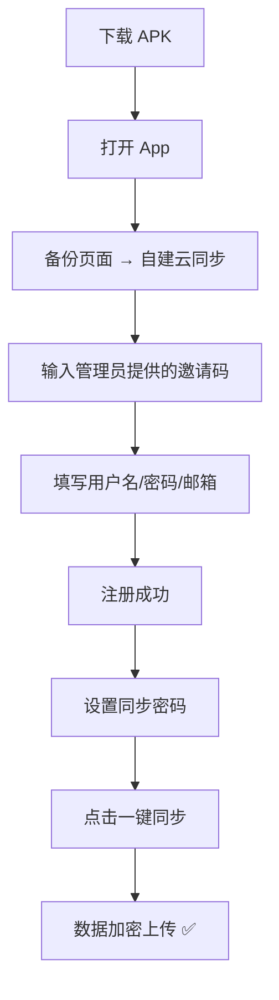
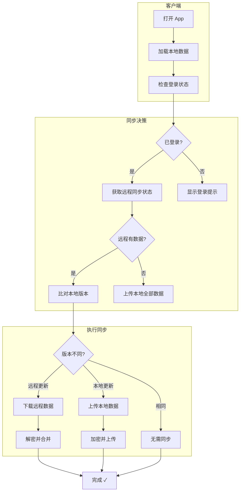
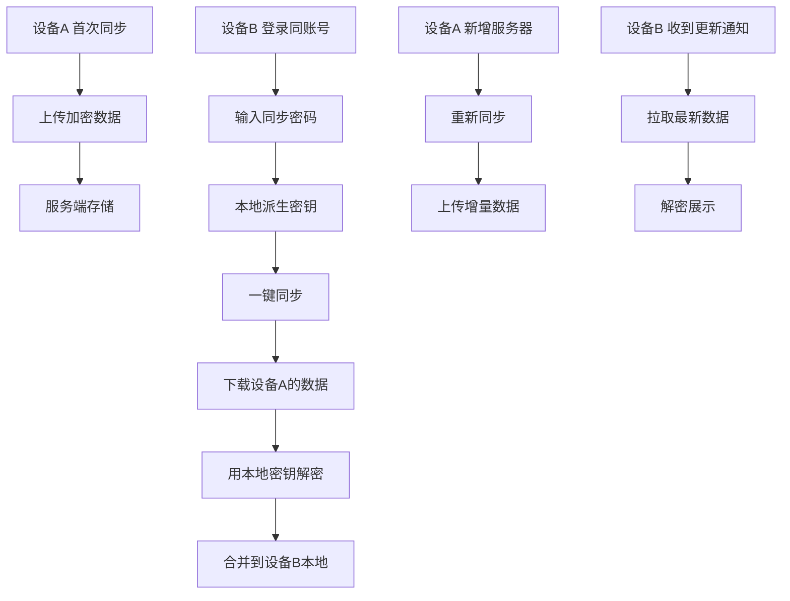
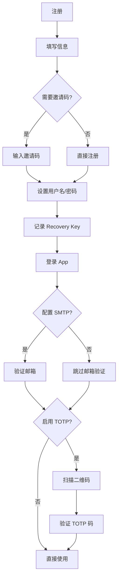
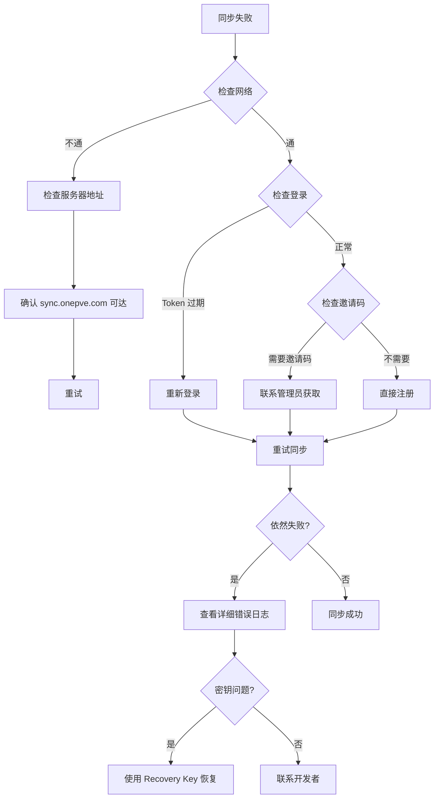
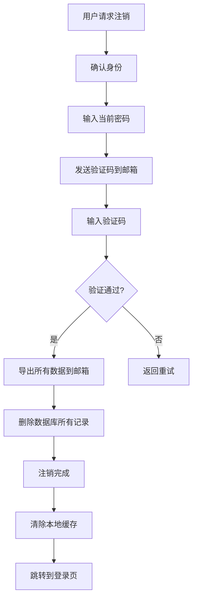

<h2 align="center">Flutter Server Box</h2>

<h3 align="center">onepve 自用分支 — 含自建云同步</h3>

<div align="center">
  
  
</div>

<p align="center">
使用 Flutter 开发的 Linux / Unix / Windows 服务器工具箱，提供服务器状态图表和管理工具。
<br>
本分支 fork 自 <a href="https://github.com/lollipopkit/flutter_server_box">lollipopkit/flutter_server_box</a>，主要面向<b>自用 + 好友共享</b>部署场景，附加了完整的自建同步后端支持。
</p>

---

## 目录

- [分支特性](#-分支特性)
- [安装与下载](#-安装与下载)
- [快速开始（云同步）](#-快速开始云同步)
- [自行构建](#-自行构建)
- [复刻自定义指南](#-复刻自定义指南)
- [同步流程详解](#-同步流程详解)
- [加密方案](#-加密方案)
- [多设备同步流程](#-多设备同步流程)
- [账户管理流程](#-账户管理流程)
- [故障排除流程](#-故障排除流程)
- [注销流程](#-注销流程)
- [项目结构](#-项目结构)
- [License](#-协议)

---

## ✨ 分支特性（基于上游 + 新增）

### ☁️ 自建云同步 — 核心功能

| 功能 | 说明 |
|:-----|:------|
| 跨设备同步 | 手机、平板、电脑间同步服务器配置和状态数据 |
| 端到端加密 | AES-256-GCM + PBKDF2 派生密钥，服务端零信任 |
| 智能一键同步 | 自动检测远程是否有更新，智能决定上传或下载 |
| 多设备共存 | 同一账号多设备同时使用，互不影响 |
| 数据安全 | 支持数据导出到邮箱、多步验证删除 |

### 🔐 用户账户系统

| 功能 | 说明 |
|:-----|:------|
| 邀请码注册 | 管理员可控，防止无关人员注册 |
| 登录/登出 | JWT Token 持久化 |
| TOTP 双因素认证 | 兼容 Google Authenticator |
| 邮箱验证 | 可选，配置 SMTP 后可用 |
| 头像和昵称 | 个人资料自定义 |
| 忘记密码 | 邮箱验证重置 |
| 注销账号 | 多步验证 + 数据清理 |
| 退出登录/删除数据 | 客户端一键操作 |

### 🛠️ 服务器管理（上游原有）

- `状态图表` CPU、内存、磁盘、网络、传感器、GPU、S.M.A.R.T…
- `SSH 终端` 全功能终端，支持 xterm
- `SFTP 文件管理` 文件浏览器
- `Docker 管理` 容器、镜像、日志
- `进程管理` / `Systemd 服务管理`
- `桌面小部件` / `推送通知` / `生物认证`
- 多语言支持（中文、英文、德文、法文、日文等）

---

## 📥 安装与下载

| 平台 | 下载 | 编译 |
|:-----|:-----|:-----|
| Android | [GitHub Releases](https://github.com/onepve/flutter_server_box/releases) | ✅ 自动（arm64-v8a / armeabi-v7a / x86_64） |
| Windows | [GitHub Releases](https://github.com/onepve/flutter_server_box/releases) | ✅ 自动 |
| Linux | [GitHub Releases](https://github.com/onepve/flutter_server_box/releases) | ✅ 自动（AppImage + .deb） |
| iOS | 暂不提供 | ❌ 未编译（需 Apple 开发者证书） |
| macOS | 暂不提供 | ❌ 未编译 |

> CI 自动编译 Android / Windows / Linux 三个平台。iOS/macOS 需自行从源码构建。

---

## 🚀 快速开始（云同步）



1. 下载并安装最新 Release 的 APK
2. 打开 App → 备份页面 → **自建云同步**
3. 使用管理员提供的邀请码注册账号
4. 登录后设置同步密码（AES-256-GCM 加密用）
5. 点击「一键同步」完成首次上传
6. 其他设备登录同账号即可自动同步

> 同步服务端地址已固定为 `sync.onepve.com`，客户端无需额外配置。

---

## 🧱 自行构建

```bash
# 1. 安装 Flutter 3.44.1+
# 2. 克隆仓库
git clone https://github.com/onepve/flutter_server_box.git
cd flutter_server_box

# 3. 安装依赖
flutter pub get

# 4. 运行
flutter run

# 5. 构建
dart run fl_build -p android   # Android
dart run fl_build -p linux     # Linux
dart run fl_build -p windows   # Windows
```

### 同步服务端搭建

自建同步后端请参考 [flutter-sync-server](https://github.com/onepve/flutter-sync-server) 项目。

---

## 🔧 复刻自定义指南

如果你复刻本项目自用，请修改以下文件：

| 文件 | 修改内容 |
|:-----|:---------|
| `lib/sync/sync_config.dart` | `serverUrl` → 你的同步服务器地址 |
| `pubspec.yaml` | `name`、`description`、`homepage` |
| `android/app/build.gradle.kts` | `applicationId` → 你的包名 |
| `.github/workflows/build.yml` | 签名密钥配置 |

---

## 🔄 同步流程详解



---

## 🔒 加密方案

```mermaid
flowchart LR
    subgraph 注册时
        A[用户输入同步密码] --> B[PBKDF2 × 100000轮]
        B --> C[生成 AES-256 密钥]
        C --> D[生成 Recovery Key]
        D --> E[密钥存储在本地设备]
    end

    subgraph 同步时
        F[原始 JSON 数据] --> G[AES-256-GCM 加密]
        G --> H[base64(iv + cipher + tag)]
        H --> I[上传到服务端]
    end

    subgraph 恢复时
        J[从服务器下载] --> K[base64 解码]
        K --> L[用本地密钥解密]
        L --> M[恢复原始数据]
    end
```

### 安全特性

- 密钥由用户同步密码派生，**服务端不存密钥**
- 每次加密使用随机 IV（初始化向量）
- 服务端无法解密任何数据（零信任架构）
- Recovery Key 用于多设备恢复，**仅注册时显示一次**
- 建议将 Recovery Key 离线保存（密码管理器或纸质备份）

---

## 📱 多设备同步流程



---

## 👤 账户管理流程



---

## 🔧 故障排除流程



---

## 🗑️ 注销流程



---

## 📁 项目结构

```
~/.hermes/onepve/code/github/repos/flutter_server_box/
├── lib/
│   ├── main.dart                # 应用入口
│   │
│   ├── core/                    # 核心工具
│   │   ├── extensions/          # Dart 扩展方法
│   │   ├── route.dart           # 路由配置
│   │   └── platform.dart        # 平台相关
│   │
│   ├── data/                    # 数据层
│   │   ├── model/               # 数据模型
│   │   │   ├── server/          # 服务器模型
│   │   │   ├── container/       # Docker 容器模型
│   │   │   └── sync/            # 同步相关模型
│   │   ├── provider/            # Riverpod 状态管理
│   │   └── store/               # Hive 本地存储
│   │
│   ├── view/                    # UI 层
│   │   ├── pages/               # 页面
│   │   │   ├── home/            # 首页
│   │   │   ├── server/          # 服务器详情
│   │   │   ├── ssh/             # SSH 终端
│   │   │   ├── sftp/            # SFTP 文件管理
│   │   │   ├── docker/          # Docker 管理
│   │   │   ├── sync/            # 同步页面
│   │   │   └── settings/        # 设置页面
│   │   └── widgets/             # 通用组件
│   │
│   ├── sync/                    # 同步模块（分支新增）
│   │   ├── sync_config.dart     # 同步配置
│   │   ├── sync_service.dart    # 同步服务
│   │   ├── crypto_helper.dart   # AES-256-GCM 加密
│   │   └── sync_ui.dart         # 同步 UI
│   │
│   └── generated/               # 自动生成
│       └── l10n/                # 本地化文件
│
├── android/
├── ios/
├── linux/
├── windows/
├── macos/
│
├── test/                        # 测试
├── docs/                        # 文档
├── pubspec.yaml
└── README.md
```

---

## ⚙️ 技术栈

| 组件 | 技术 |
|:-----|:-----|
| UI 框架 | Flutter 3.44+ |
| 状态管理 | Riverpod（代码生成） |
| 本地存储 | Hive CE |
| SSH/SFTP | dartssh2（自维护 fork） |
| 终端 | xterm.dart（自维护 fork） |
| 网络请求 | dio |
| 图表 | fl_chart |
| 代码生成 | build_runner + freezed + json_serializable |

---

## 📝 协议

`AGPL v3 — lollipopkit & 所有贡献者`
